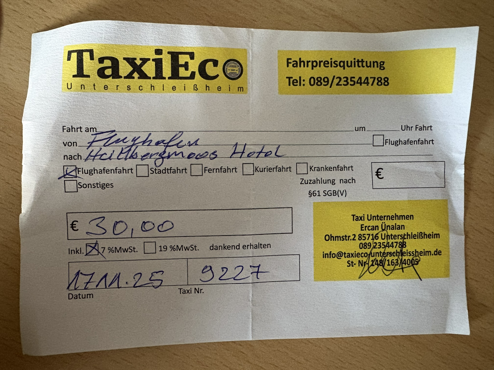
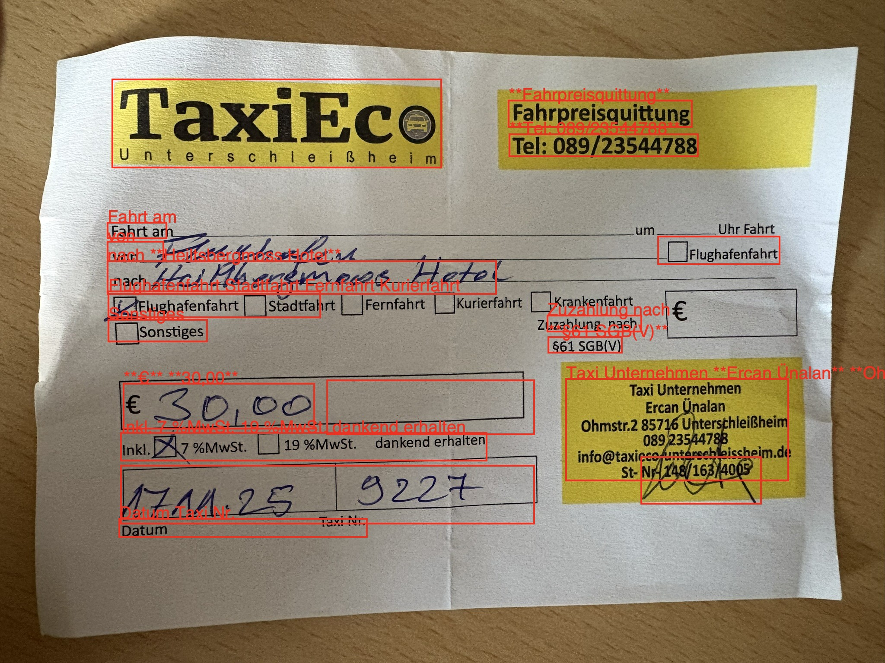
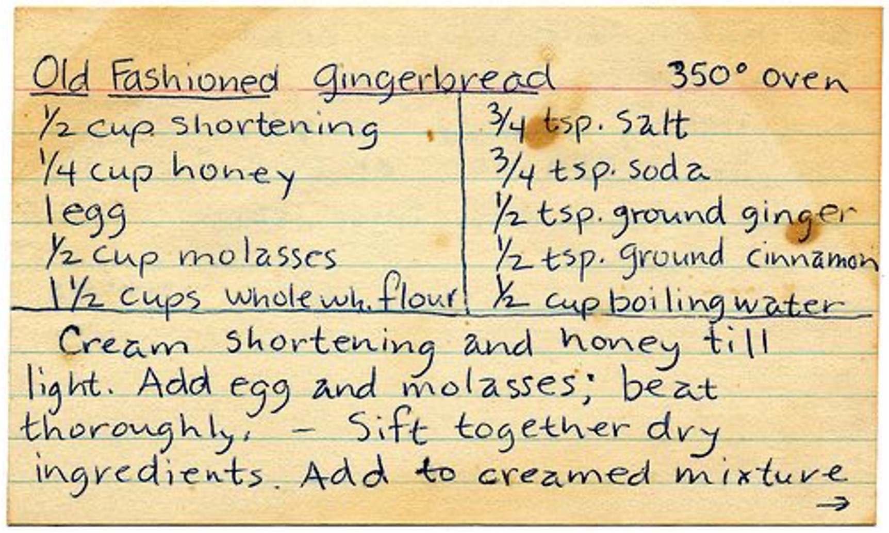

# Deepseek-OCR Experiments

This experiment demonstrates what is possible with using Deepseek-OCR locally.

## Prerequisites

```bash
ollama serve
ollama pull deepseek-ocr
```

We can then use the following prompt on an image:

```prompt
<|grounding|>Convert the document to markdown.
```

## Taxi Reciept



Deepseek-OCR responds with bounding boxes like this:

```output
<|ref|>text<|/ref|><|det|>[[575, 152, 782, 192]]<|/det|>
**Fahrpreisquittung**

<|ref|>text<|/ref|><|det|>[[576, 203, 789, 236]]<|/det|>
**Tel: 089/23544788**

<|ref|>text<|/ref|><|det|>[[122, 336, 188, 360]]<|/det|>
Fahrt am

<|ref|>text<|/ref|><|det|>[[122, 365, 185, 394]]<|/det|>
von
````



## Recipe



Deepseek-OCR responds like this:

```output
<|ref|>table<|/ref|><|det|>[[18, 72, 985, 643]]<|/det|>
<table><tr><td>Old Fashioned Gingerbread</td><td>350° oven</td></tr><tr><td>½ cup shortening</td><td>3/4 tsp. salt</td></tr><tr><td>¼ cup honey</td><td>3/4 tsp. soda</td></tr><tr><td>1 egg</td><td>½ tsp. ground ginger</td></tr><tr><td>½ cup molasses</td><td>½ tsp. ground cinnamon</td></tr><tr><td>1/2 cups whole wh. flour</td><td>½ cup boiling water</td></tr></table>

<|ref|>text<|/ref|><|det|>[[18, 610, 975, 959]]<|/det|>
Cream shortening and honey till light. Add egg and molasses; beat thoroughly, - Sift together dry ingredients. Add to creamed mixture[Unsupported content type: UsageContent]Parsing detected bounding boxes...
{"Coordinates":{"X1":18,"Y1":72,"X2":985,"Y2":643},"Type":"table","Value":null}
{"Coordinates":{"X1":18,"Y1":610,"X2":975,"Y2":959},"Type":"text","Value":"Cream shortening and honey till light. Add egg and molasses; beat thoroughly, - Sift together dry ingredients. Add to creamed mixture"}
```
